<small>_Click on the_ ▶ _︎arrows to expand sections._</small>


<details>
<summary>shared borders with country with existing outbreak</summary>
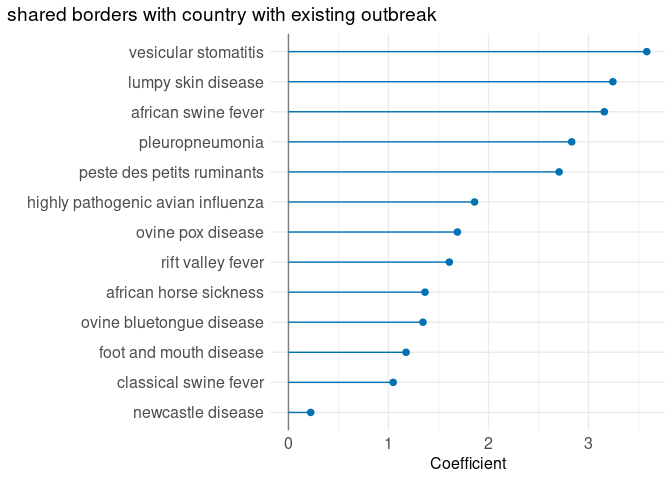<!-- -->
</details>
<details>
<summary>trade value of animal products from countries with existing outbreak</summary>
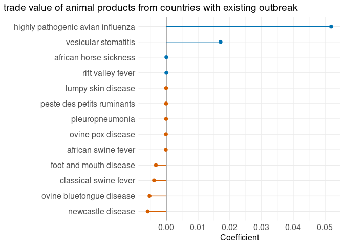<!-- -->
</details>
<details>
<summary>asses from countries with existing outbreak</summary>
<!-- -->
</details>
<details>
<summary>buffaloes from countries with existing outbreak</summary>
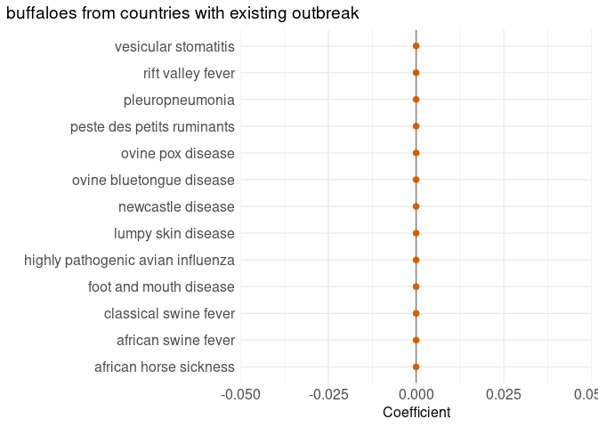<!-- -->
</details>
<details>
<summary>camelids (other) from countries with existing outbreak</summary>
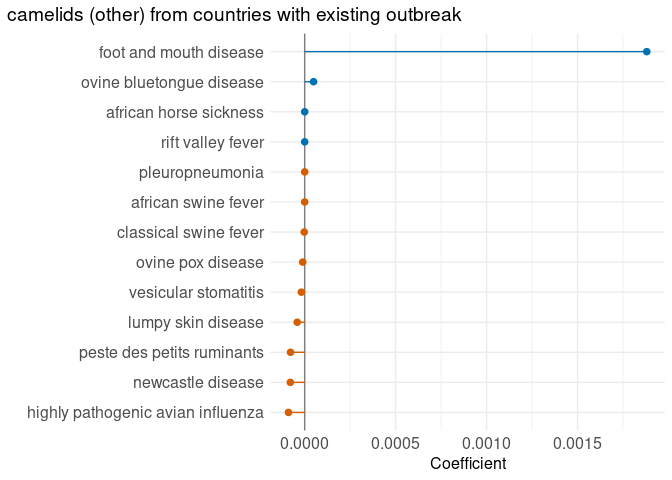<!-- -->
</details>
<details>
<summary>camels from countries with existing outbreak</summary>
<!-- -->
</details>
<details>
<summary>cattle from countries with existing outbreak</summary>
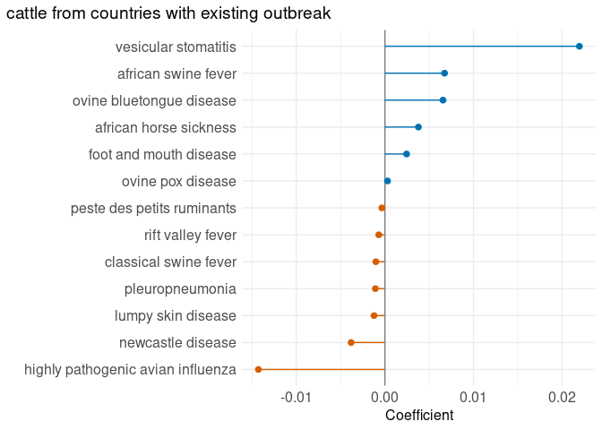<!-- -->
</details>
<details>
<summary>chickens from countries with existing outbreak</summary>
<!-- -->
</details>
<details>
<summary>ducks from countries with existing outbreak</summary>
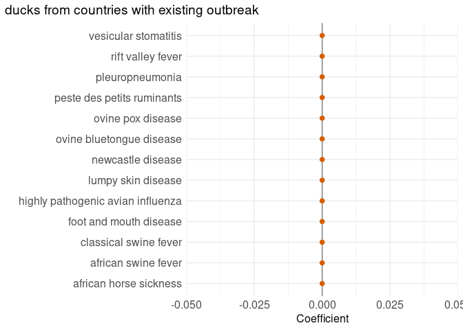<!-- -->
</details>
<details>
<summary>goats from countries with existing outbreak</summary>
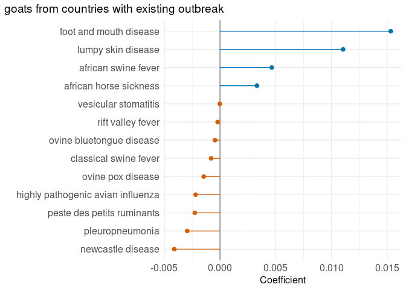<!-- -->
</details>
<details>
<summary>horses from countries with existing outbreak</summary>
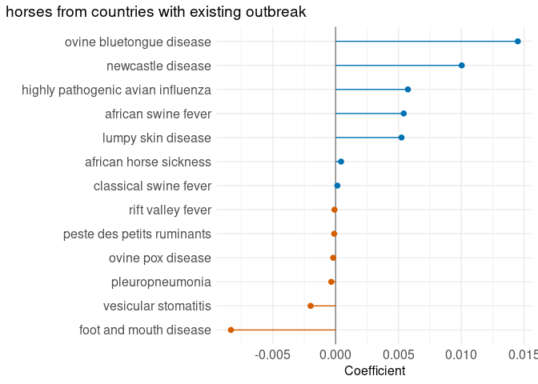<!-- -->
</details>
<details>
<summary>mules from countries with existing outbreak</summary>
<!-- -->
</details>
<details>
<summary>pigeons (other) birds from countries with existing outbreak</summary>
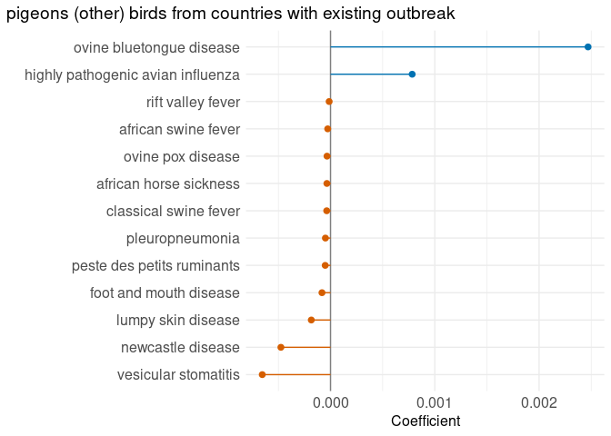<!-- -->
</details>
<details>
<summary>pigs from countries with existing outbreak</summary>
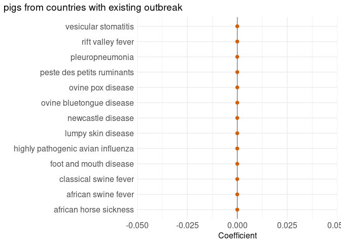<!-- -->
</details>
<details>
<summary>rabbits and hares from countries with existing outbreak</summary>
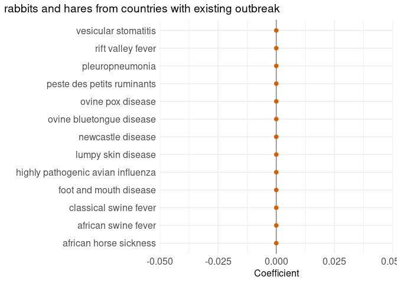<!-- -->
</details>
<details>
<summary>rodents (other) from countries with existing outbreak</summary>
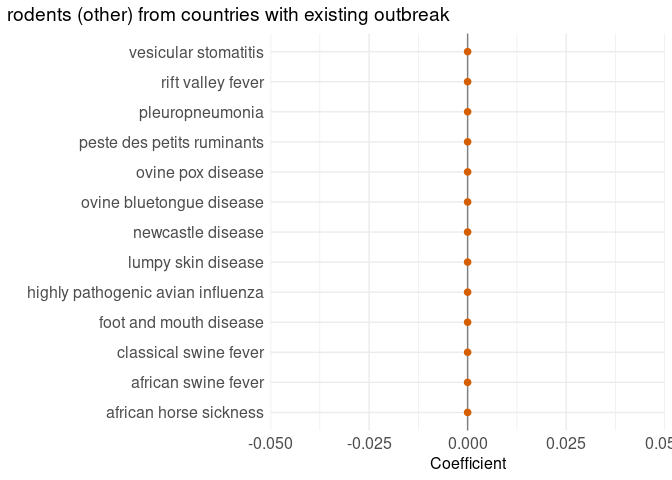<!-- -->
</details>
<details>
<summary>sheep from countries with existing outbreak</summary>
<!-- -->
</details>
<details>
<summary>turkeys from countries with existing outbreak</summary>
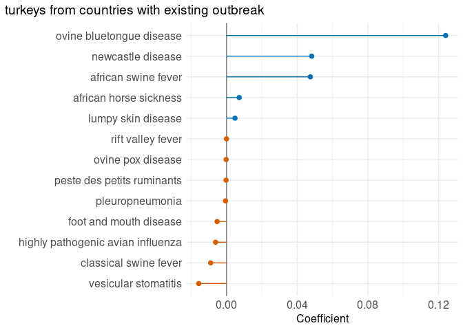<!-- -->
</details>

<details>
<summary>Validation</summary>

```
## [1] TRUE
```

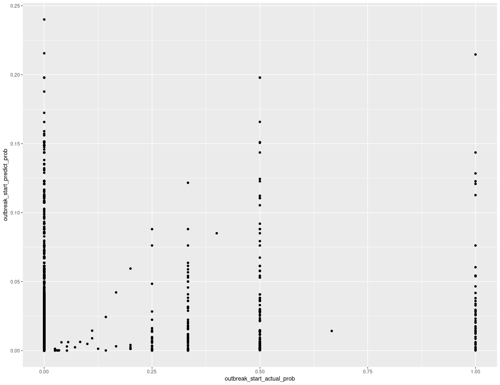<!-- -->
</details>
