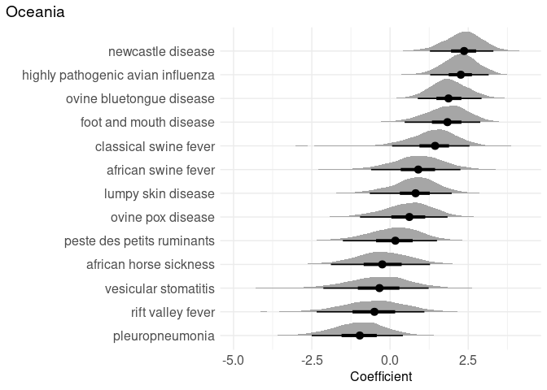
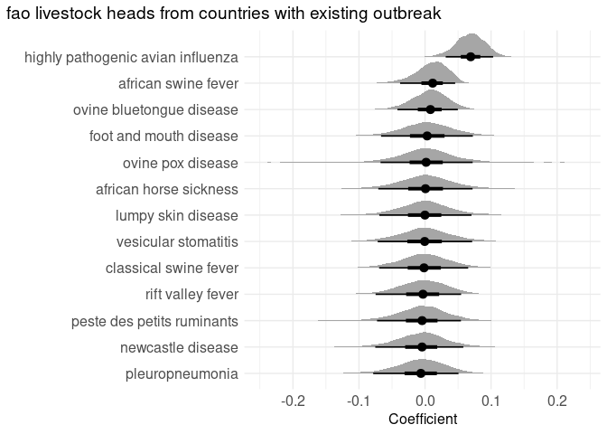
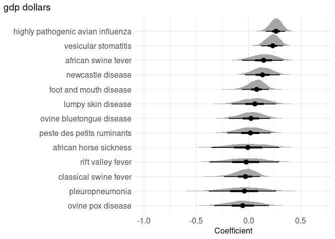
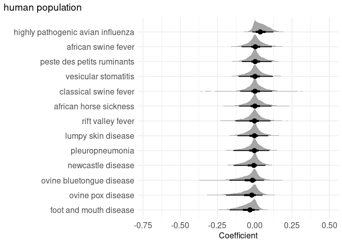
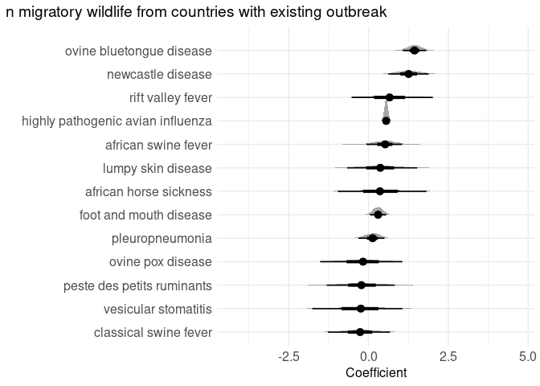
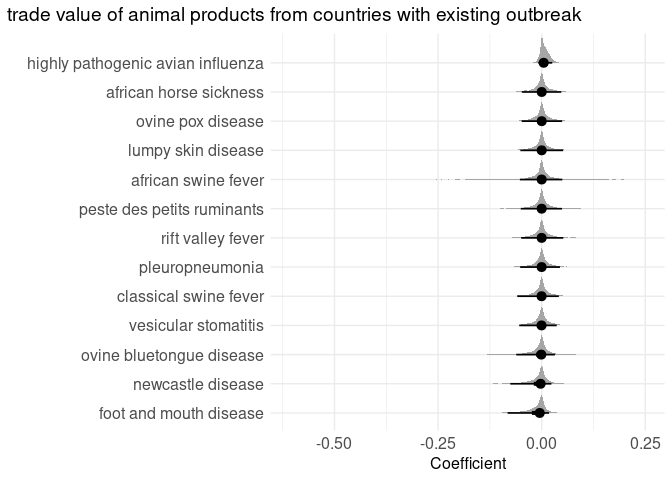
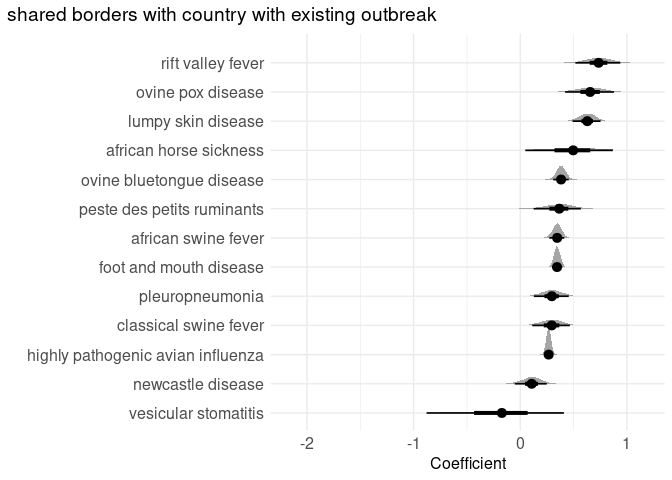
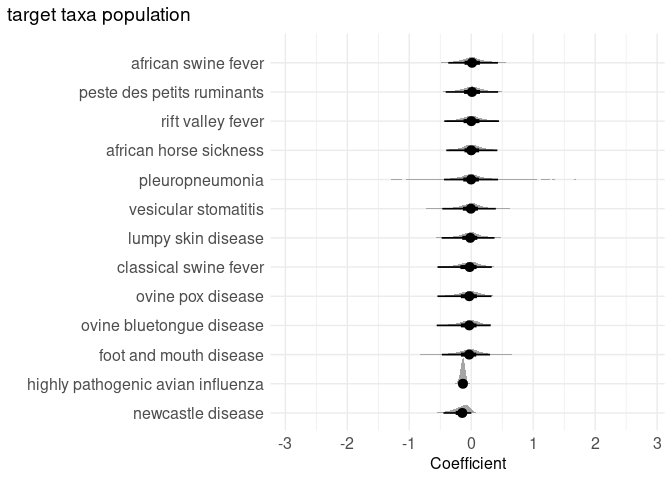
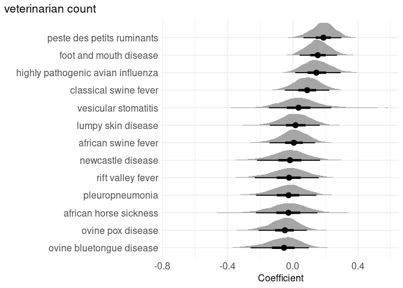
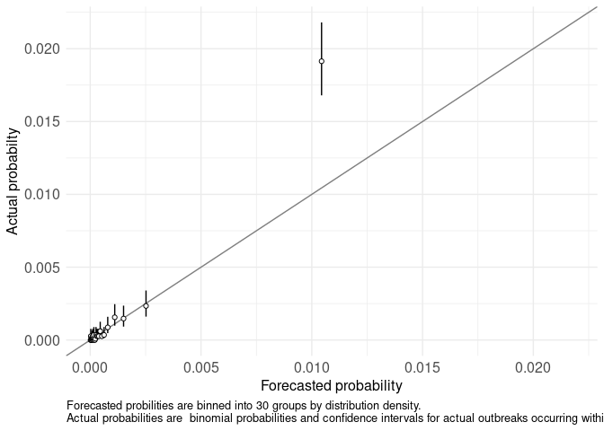

<small>_Click on the_ ▶ _︎arrows to expand sections._</small>


### lme4


<details>
<summary>Africa</summary>
<!-- -->
</details>
<details>
<summary>Americas</summary>
<!-- -->
</details>
<details>
<summary>Asia</summary>
<!-- -->
</details>
<details>
<summary>Europe</summary>
<!-- -->
</details>
<details>
<summary>Oceania</summary>
<!-- -->
</details>
<details>
<summary>shared borders with country with existing outbreak</summary>
<!-- -->
</details>
<details>
<summary>ots trade dollars from countries with existing outbreak</summary>
<!-- -->
</details>
<details>
<summary>fao livestock heads from countries with existing outbreak</summary>
<!-- -->
</details>
<details>
<summary>n migratory wildlife from countries with existing outbreak</summary>
<!-- -->
</details>
<details>
<summary>gdp dollars</summary>
<!-- -->
</details>
<details>
<summary>human population</summary>
<!-- -->
</details>
<details>
<summary>target taxa population</summary>
<!-- -->
</details>
<details>
<summary>veterinarian count</summary>
<!-- -->
</details>


<details>
<summary>validation</summary>

```
## [1] TRUE
```

<!-- -->
</details>


### brms


<details>
<summary>Africa</summary>
<!-- -->
</details>
<details>
<summary>Americas</summary>
<!-- -->
</details>
<details>
<summary>Asia</summary>
<!-- -->
</details>
<details>
<summary>Europe</summary>
<!-- -->
</details>
<details>
<summary>Oceania</summary>
<!-- -->
</details>
<details>
<summary>fao livestock heads from countries with existing outbreak</summary>
<!-- -->
</details>
<details>
<summary>gdp dollars</summary>
<!-- -->
</details>
<details>
<summary>human population</summary>
<!-- -->
</details>
<details>
<summary>n migratory wildlife from countries with existing outbreak</summary>
<!-- -->
</details>
<details>
<summary>trade value of animal products from countries with existing outbreak</summary>
<!-- -->
</details>
<details>
<summary>shared borders with country with existing outbreak</summary>
<!-- -->
</details>
<details>
<summary>target taxa population</summary>
<!-- -->
</details>
<details>
<summary>veterinarian count</summary>
<!-- -->
</details>


<details>
<summary>validation</summary>
<!-- -->
</details>
