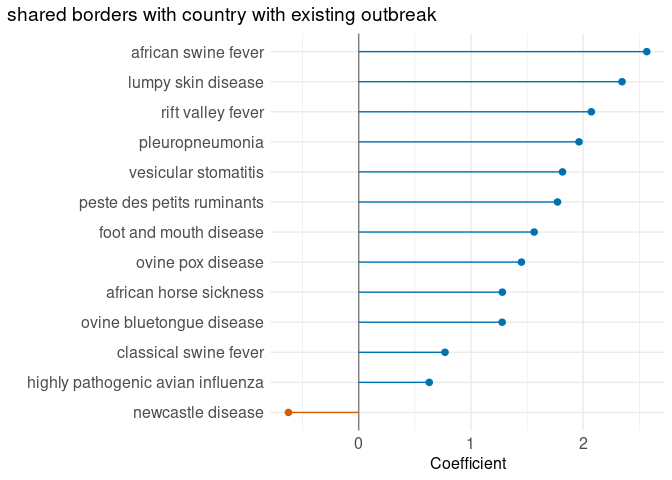
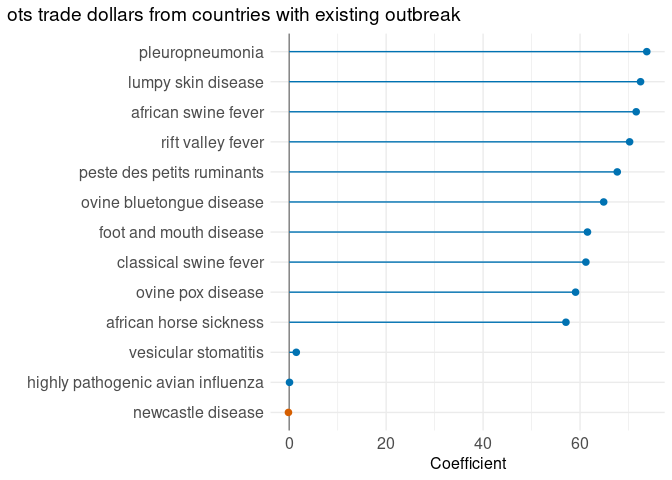
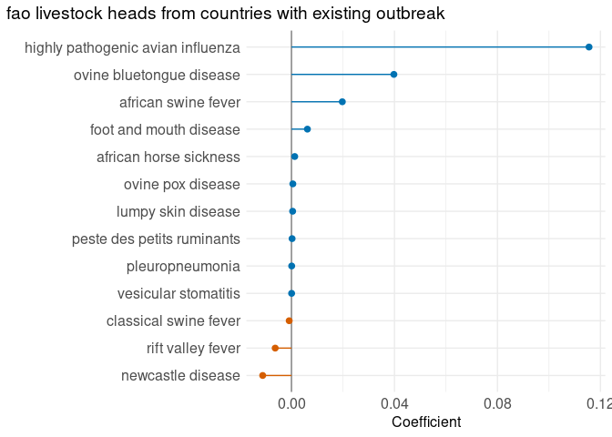
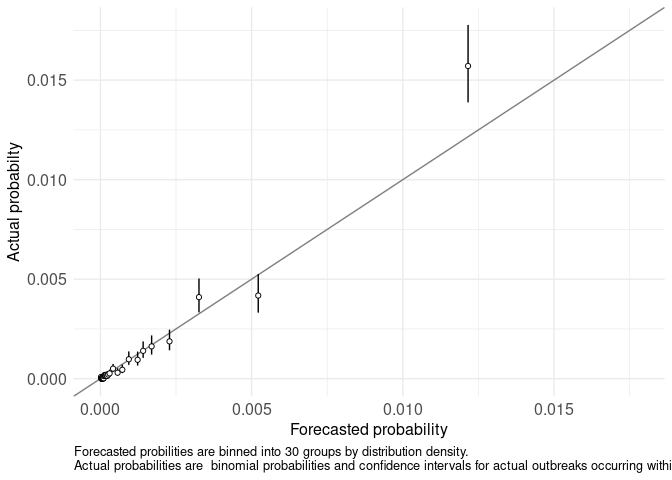
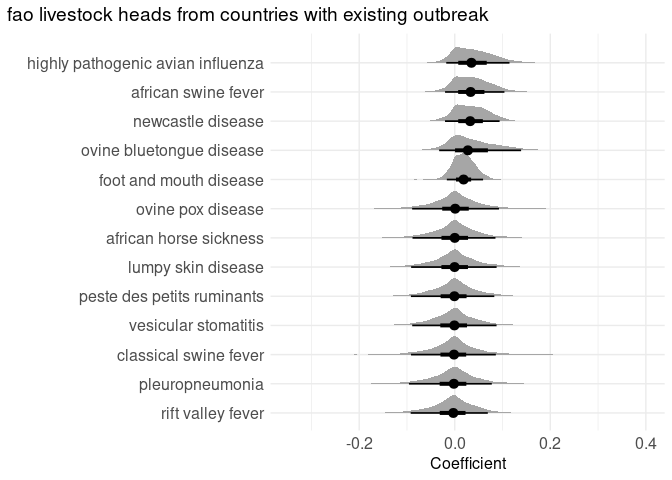
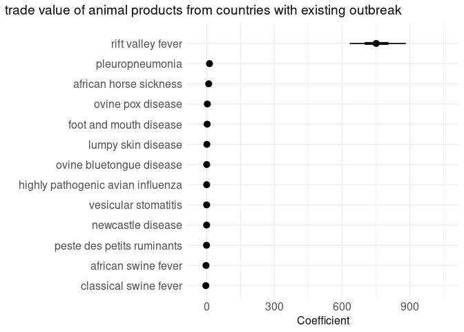
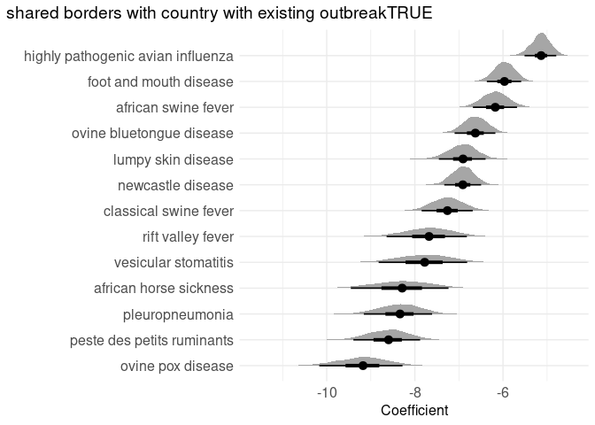

<small>_Click on the_ ▶ _︎arrows to expand sections._</small>


### lme4


<details>
<summary>shared borders with country with existing outbreak</summary>
<!-- -->
</details>
<details>
<summary>trade value of animal products from countries with existing outbreak</summary>
<!-- -->
</details>
<details>
<summary>fao livestock heads from countries with existing outbreak</summary>
<!-- -->
</details>

<details>
<summary>validation</summary>

```
## [1] TRUE
```

<!-- -->
</details>

### brms


<details>
<summary>fao livestock heads from countries with existing outbreak</summary>
<!-- -->
</details>
<details>
<summary>trade value of animal products from countries with existing outbreak</summary>
<!-- -->
</details>
<details>
<summary>shared borders with country with existing outbreakFALSE</summary>
<!-- -->
</details>
<details>
<summary>shared borders with country with existing outbreakTRUE</summary>
<!-- -->
</details>


<details>
<summary>validation</summary>

</details>
