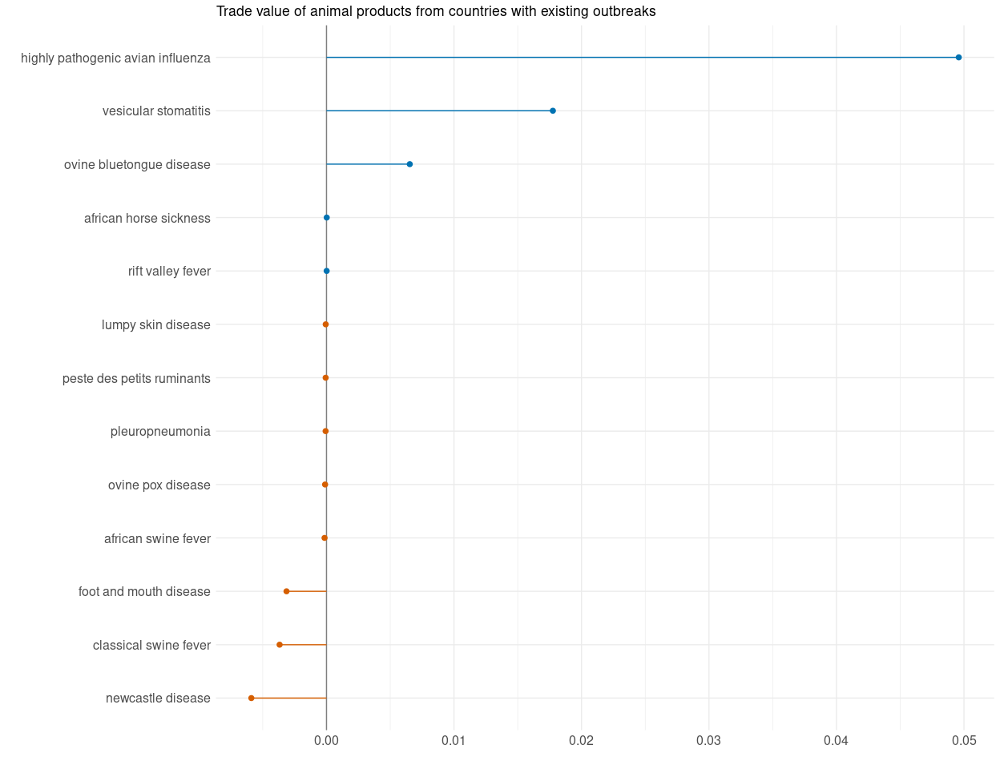
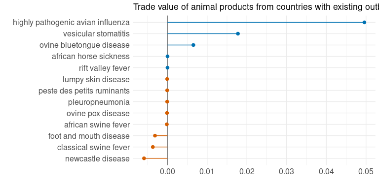

```
## Generalized linear mixed model fit by maximum likelihood (Adaptive
##   Gauss-Hermite Quadrature, nAGQ = 0) [glmerMod]
##  Family: binomial  ( logit )
## Formula: 
## outbreak_start ~ 0 + (1 | country_iso3c:disease) + (0 + shared_borders_from_outbreaks |  
##     disease) + (0 + ots_trade_dollars_from_outbreaks | disease) +  
##     (0 + fao_livestock_heads_from_outbreaks | disease)
##    Data: augmented_data_compressed
## Weights: wgts
## Control: glmerControl(calc.derivs = TRUE)
## 
##      AIC      BIC   logLik deviance df.resid 
##  17115.0  17175.1  -8551.5  17103.0   164686 
## 
## Scaled residuals: 
##    Min     1Q Median     3Q    Max 
## -2.255 -0.058 -0.034 -0.023 48.727 
## 
## Random effects:
##  Groups                Name                               Variance  Std.Dev.
##  country_iso3c.disease (Intercept)                        2.796e+00  1.67209
##  disease               shared_borders_from_outbreaksFALSE 1.084e+02 10.40943
##                        shared_borders_from_outbreaksTRUE  7.531e+01  8.67839
##  disease.1             ots_trade_dollars_from_outbreaks   2.737e-03  0.05231
##  disease.2             fao_livestock_heads_from_outbreaks 3.926e-03  0.06266
##  Corr
##      
##      
##  0.99
##      
##      
## Number of obs: 164692, groups:  country_iso3c:disease, 9617; disease, 59
```

<!-- --><!-- -->

<!-- -->

