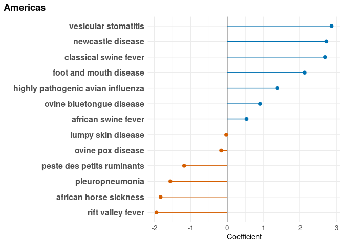
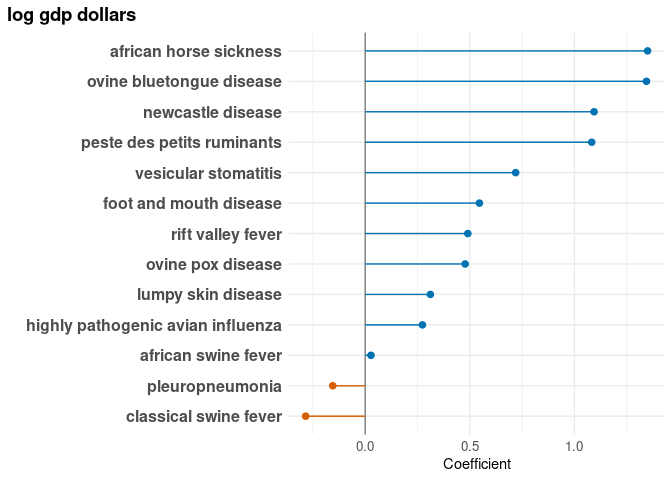
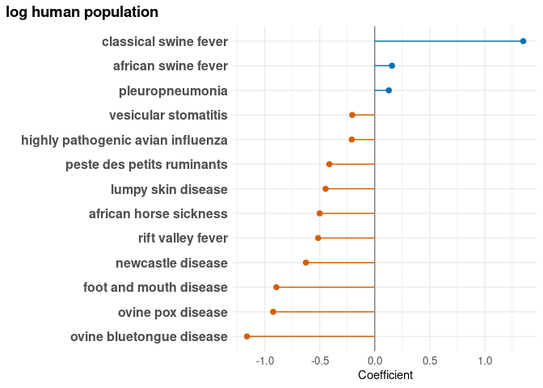
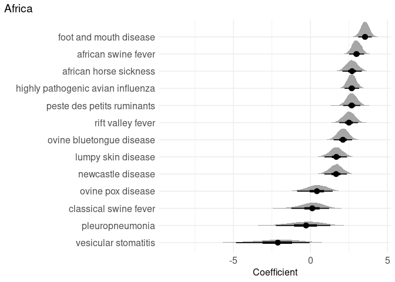
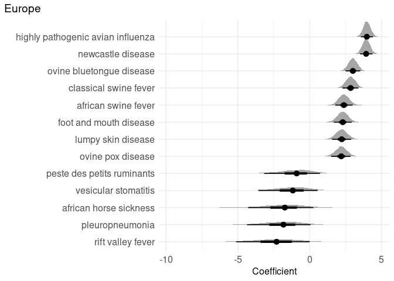
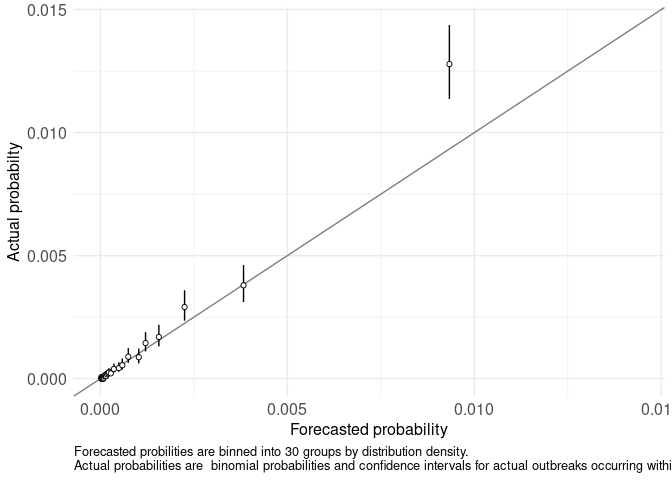

<small>_Click on the_ ▶ _︎arrows to expand sections._</small>


### lme4


<details>
<summary>Africa</summary>
<!-- -->
</details>
<details>
<summary>Americas</summary>
<!-- -->
</details>
<details>
<summary>Asia</summary>
<!-- -->
</details>
<details>
<summary>Europe</summary>
<!-- -->
</details>
<details>
<summary>Oceania</summary>
<!-- -->
</details>
<details>
<summary>shared borders with country with existing outbreak</summary>
<!-- -->
</details>
<details>
<summary>ots trade dollars from countries with existing outbreak</summary>
<!-- -->
</details>
<details>
<summary>fao livestock heads from countries with existing outbreak</summary>
<!-- -->
</details>
<details>
<summary>n migratory wildlife from countries with existing outbreak</summary>
<!-- -->
</details>
<details>
<summary>gdp dollars</summary>
<!-- -->
</details>
<details>
<summary>human population</summary>
<!-- -->
</details>
<details>
<summary>target taxa population</summary>
<!-- -->
</details>
<details>
<summary>veterinarian count</summary>
<!-- -->
</details>


<details>
<summary>validation</summary>

```
## [1] TRUE
```

<!-- -->
</details>


### brms


<details>
<summary>Africa</summary>
<!-- -->
</details>
<details>
<summary>Americas</summary>
<!-- -->
</details>
<details>
<summary>Asia</summary>
<!-- -->
</details>
<details>
<summary>Europe</summary>
<!-- -->
</details>
<details>
<summary>Oceania</summary>
<!-- -->
</details>
<details>
<summary>fao livestock heads from countries with existing outbreak</summary>
<!-- -->
</details>
<details>
<summary>gdp dollars</summary>
<!-- -->
</details>
<details>
<summary>human population</summary>
<!-- -->
</details>
<details>
<summary>n migratory wildlife from countries with existing outbreak</summary>
<!-- -->
</details>
<details>
<summary>trade value of animal products from countries with existing outbreak</summary>
<!-- -->
</details>
<details>
<summary>shared borders with country with existing outbreak</summary>
<!-- -->
</details>
<details>
<summary>target taxa population</summary>
<!-- -->
</details>
<details>
<summary>veterinarian count</summary>
<!-- -->
</details>


<details>
<summary>validation</summary>

```
## [1] "0"
## [1] "1"
## [1] "2"
## [1] "3"
## [1] "4"
## [1] "5"
## [1] "6"
## [1] "7"
## [1] "8"
## [1] "9"
## [1] "10"
## [1] "11"
## [1] "12"
## [1] "13"
## [1] "14"
## [1] "15"
## [1] "16"
## [1] "17"
## [1] "18"
## [1] "19"
## [1] "20"
## [1] "21"
## [1] "22"
## [1] "23"
## [1] "24"
## [1] "25"
## [1] "26"
## [1] "27"
## [1] "28"
## [1] "29"
## [1] "30"
## [1] "31"
## [1] "32"
## [1] "33"
## [1] "34"
## [1] "35"
## [1] "36"
## [1] "37"
## [1] "38"
## [1] "39"
## [1] "40"
## [1] "41"
## [1] "42"
## [1] "43"
## [1] "44"
## [1] "45"
```

<!-- -->
</details>
