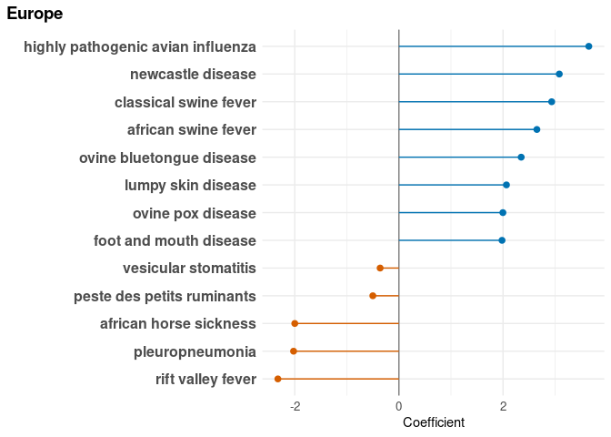
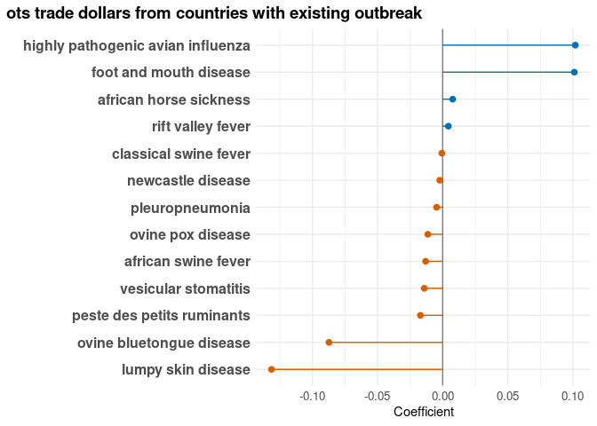
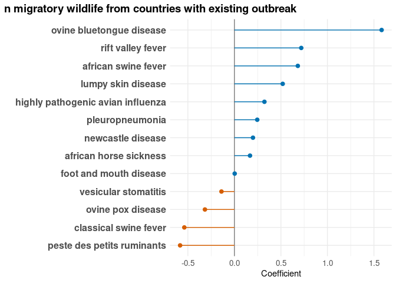
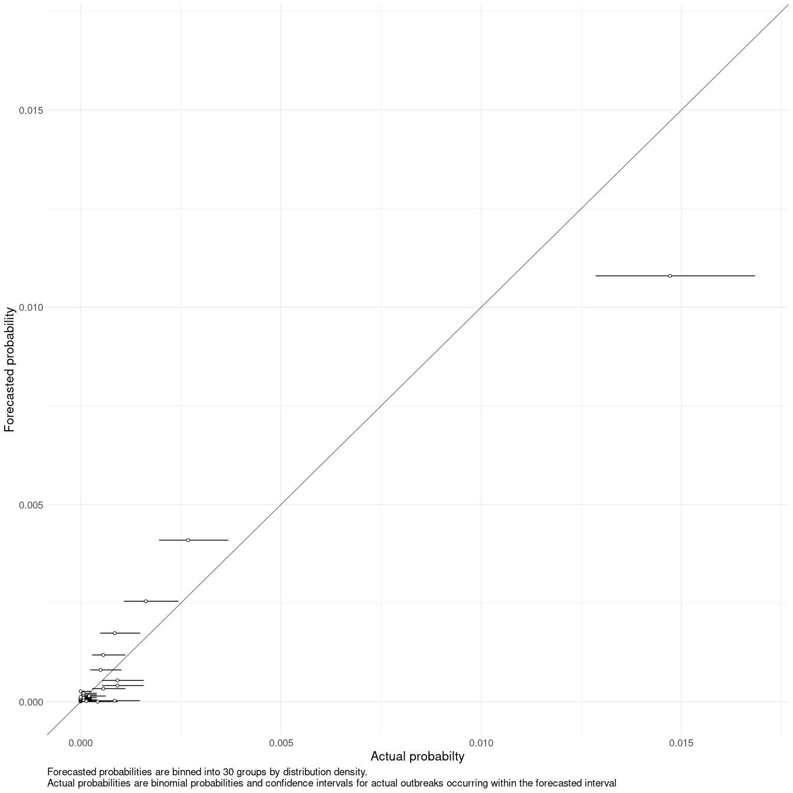
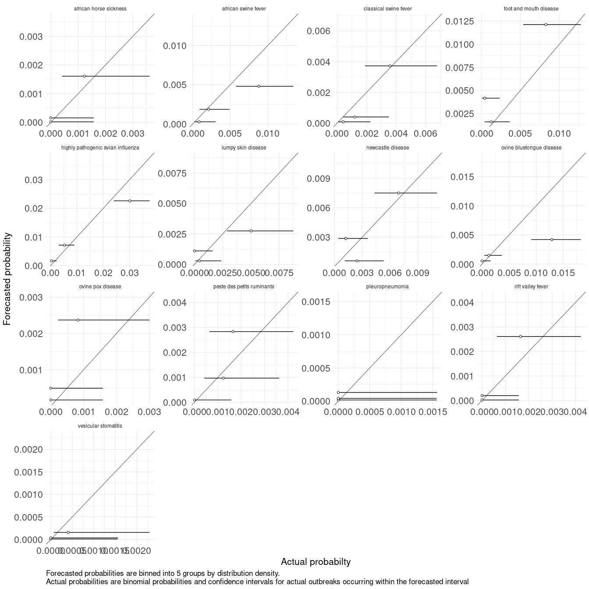
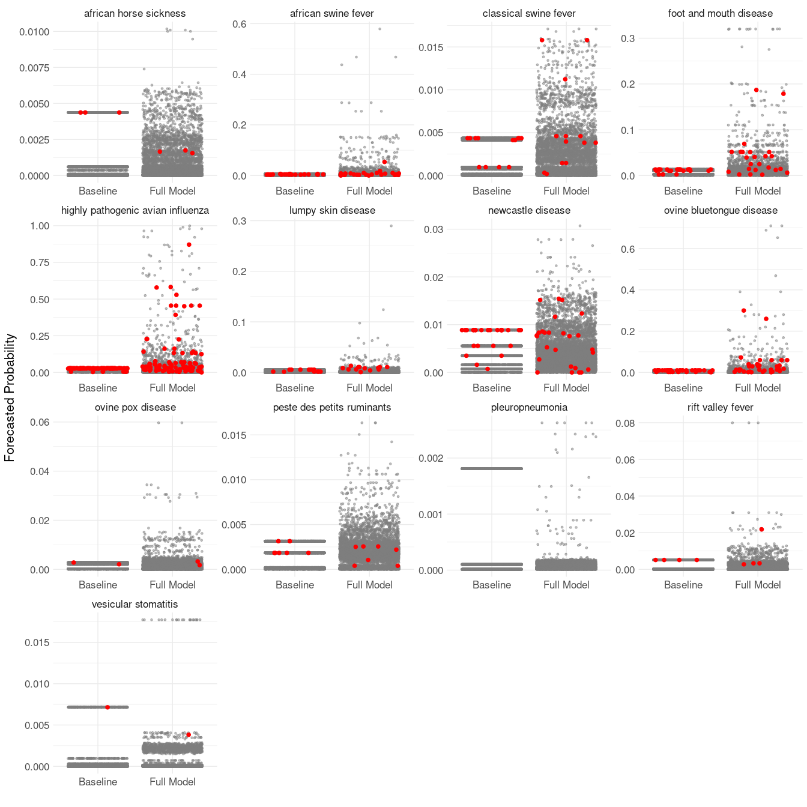

<small>_Click on the_ ▶ _︎arrows to expand sections._</small>


### lme4


<details>
<summary>residuals</summary>
<!-- --><!-- -->
</details>

<details>
<summary>model summary</summary>

```
## Generalized linear mixed model fit by maximum likelihood (Adaptive
##   Gauss-Hermite Quadrature, nAGQ = 0) [glmerMod]
##  Family: binomial  ( logit )
## Formula: 
## outbreak_start ~ (0 + continent | disease) + (0 + shared_borders_from_outbreaks |  
##     disease) + (0 + ots_trade_dollars_from_outbreaks | disease) +  
##     (0 + fao_livestock_heads_from_outbreaks | disease) + (0 +  
##     n_migratory_wildlife_from_outbreaks | disease) + (0 + log_gdp_dollars |  
##     disease) + (0 + log_human_population | disease) + (0 + log_target_taxa_population |  
##     disease) + (0 + log_veterinarians | disease)
##    Data: augmented_data_compressed
## Weights: wgts
## Control: glmerControl(calc.derivs = TRUE)
## 
##      AIC      BIC   logLik deviance df.resid 
##  18346.1  18606.7  -9149.0  18298.1   384328 
## 
## Scaled residuals: 
##    Min     1Q Median     3Q    Max 
##  -6.26  -0.06  -0.03  -0.02 918.39 
## 
## Random effects:
##  Groups    Name                                Variance  Std.Dev. Corr       
##  disease   continentAfrica                     5.6911682 2.38562             
##            continentAmericas                   3.3500077 1.83030  -0.04      
##            continentAsia                       4.2268658 2.05593   0.84  0.25
##            continentEurope                     4.1356430 2.03363   0.18  0.63
##            continentOceania                    0.9810750 0.99049   0.55  0.31
##  disease.1 shared_borders_from_outbreaks       0.0983553 0.31362             
##  disease.2 ots_trade_dollars_from_outbreaks    0.0096375 0.09817             
##  disease.3 fao_livestock_heads_from_outbreaks  0.0005926 0.02434             
##  disease.4 n_migratory_wildlife_from_outbreaks 0.5865768 0.76588             
##  disease.5 log_gdp_dollars                     1.3348996 1.15538             
##  disease.6 log_human_population                0.6441507 0.80259             
##  disease.7 log_target_taxa_population          1.3666570 1.16904             
##  disease.8 log_veterinarians                   0.0436349 0.20889             
##             
##             
##             
##             
##   0.58      
##   0.74  0.87
##             
##             
##             
##             
##             
##             
##             
##             
## Number of obs: 384352, groups:  disease, 58
## 
## Fixed effects:
##             Estimate Std. Error z value Pr(>|z|)    
## (Intercept)   -8.850      0.202  -43.82   <2e-16 ***
## ---
## Signif. codes:  0 '***' 0.001 '**' 0.01 '*' 0.05 '.' 0.1 ' ' 1
```


|variable                            |  variance|
|:-----------------------------------|---------:|
|continentAfrica                     | 5.6911682|
|continentAmericas                   | 3.3500077|
|continentAsia                       | 4.2268658|
|continentEurope                     | 4.1356430|
|continentOceania                    | 0.9810750|
|shared_borders_from_outbreaks       | 0.0983553|
|ots_trade_dollars_from_outbreaks    | 0.0096375|
|fao_livestock_heads_from_outbreaks  | 0.0005926|
|n_migratory_wildlife_from_outbreaks | 0.5865768|
|log_gdp_dollars                     | 1.3348996|
|log_human_population                | 0.6441507|
|log_target_taxa_population          | 1.3666570|
|log_veterinarians                   | 0.0436349|
</details>


<details>
<summary>Africa</summary>
<!-- -->
</details>
<details>
<summary>Americas</summary>
<!-- -->
</details>
<details>
<summary>Asia</summary>
<!-- -->
</details>
<details>
<summary>Europe</summary>
<!-- -->
</details>
<details>
<summary>Oceania</summary>
<!-- -->
</details>
<details>
<summary>shared borders with country with existing outbreak</summary>
<!-- -->
</details>
<details>
<summary>ots trade dollars from countries with existing outbreak</summary>
<!-- -->
</details>
<details>
<summary>fao livestock heads from countries with existing outbreak</summary>
<!-- -->
</details>
<details>
<summary>n migratory wildlife from countries with existing outbreak</summary>
<!-- -->
</details>
<details>
<summary>log gdp dollars</summary>
<!-- -->
</details>
<details>
<summary>log human population</summary>
<!-- -->
</details>
<details>
<summary>log target taxa population</summary>
<!-- -->
</details>
<details>
<summary>log veterinarians</summary>
<!-- -->
</details>

<details>
<summary>validation</summary>

```
## [1] TRUE
```

<!-- --><!-- --><!-- -->
</details>

