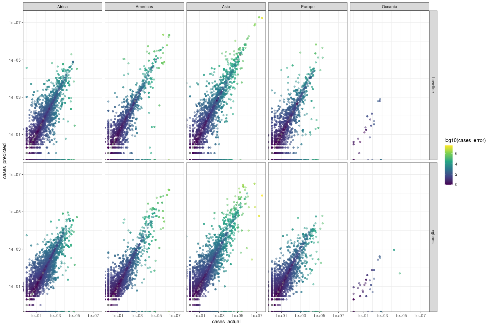

## Variable importance
<details>
<summary>disease status overall variable importance</summary>

```
## [15:57:04] WARNING: /root/xgboost/src/learner.cc:1026: 
##   If you are loading a serialized model (like pickle in Python, RDS in R) generated by
##   older XGBoost, please export the model by calling `Booster.save_model` from that version
##   first, then load it back in current version. See:
## 
##     https://xgboost.readthedocs.io/en/latest/tutorials/saving_model.html
## 
##   for more details about differences between saving model and serializing.
## 
## [15:57:04] WARNING: /root/xgboost/src/learner.cc:735: Found JSON model saved before XGBoost 1.6, please save the model using current version again. The support for old JSON model will be discontinued in XGBoost 2.3.
```

<!-- -->
</details>

<details>
<summary>cases overall variable importance</summary>

```
## [15:57:04] WARNING: /root/xgboost/src/learner.cc:1026: 
##   If you are loading a serialized model (like pickle in Python, RDS in R) generated by
##   older XGBoost, please export the model by calling `Booster.save_model` from that version
##   first, then load it back in current version. See:
## 
##     https://xgboost.readthedocs.io/en/latest/tutorials/saving_model.html
## 
##   for more details about differences between saving model and serializing.
## 
## [15:57:04] WARNING: /root/xgboost/src/learner.cc:735: Found JSON model saved before XGBoost 1.6, please save the model using current version again. The support for old JSON model will be discontinued in XGBoost 2.3.
```

<!-- -->
</details>

<details>
<summary>disease status partial dependency of lag vars by disease</summary>
<!-- -->
</details>

<details>
<summary>cases partial dependency of variables of interest by disease</summary>
<!-- -->
</details>


## Validation


<details>
<summary>disease status confusion matrix (all data)</summary>
<table class="table" style="margin-left: auto; margin-right: auto;">
 <thead>
  <tr>
   <th style="text-align:left;"> .metric </th>
   <th style="text-align:left;"> desc </th>
   <th style="text-align:left;"> model </th>
   <th style="text-align:right;"> .estimate </th>
  </tr>
 </thead>
<tbody>
  <tr>
   <td style="text-align:left;"> accuracy </td>
   <td style="text-align:left;"> proportion of the data that are predicted correctly </td>
   <td style="text-align:left;"> baseline </td>
   <td style="text-align:right;"> 0.96 </td>
  </tr>
  <tr>
   <td style="text-align:left;"> accuracy </td>
   <td style="text-align:left;"> proportion of the data that are predicted correctly </td>
   <td style="text-align:left;"> xgboost </td>
   <td style="text-align:right;"> 0.97 </td>
  </tr>
  <tr>
   <td style="text-align:left;"> kap </td>
   <td style="text-align:left;"> similar measure to accuracy(), but is normalized by the accuracy that would be expected by chance alone and is very useful when one or more classes have large frequency distributions. </td>
   <td style="text-align:left;"> baseline </td>
   <td style="text-align:right;"> 0.84 </td>
  </tr>
  <tr>
   <td style="text-align:left;"> kap </td>
   <td style="text-align:left;"> similar measure to accuracy(), but is normalized by the accuracy that would be expected by chance alone and is very useful when one or more classes have large frequency distributions. </td>
   <td style="text-align:left;"> xgboost </td>
   <td style="text-align:right;"> 0.86 </td>
  </tr>
</tbody>
</table>
</details>

<details>
<summary>disease status outbreak start confusion matrix</summary>
<table class="table" style="margin-left: auto; margin-right: auto;">
 <thead>
  <tr>
   <th style="text-align:left;"> .metric </th>
   <th style="text-align:left;"> desc </th>
   <th style="text-align:left;"> model </th>
   <th style="text-align:right;"> .estimate </th>
  </tr>
 </thead>
<tbody>
  <tr>
   <td style="text-align:left;"> accuracy </td>
   <td style="text-align:left;"> proportion of the data that are predicted correctly </td>
   <td style="text-align:left;"> baseline </td>
   <td style="text-align:right;"> 0.00 </td>
  </tr>
  <tr>
   <td style="text-align:left;"> accuracy </td>
   <td style="text-align:left;"> proportion of the data that are predicted correctly </td>
   <td style="text-align:left;"> xgboost </td>
   <td style="text-align:right;"> 0.36 </td>
  </tr>
</tbody>
</table>
</details>

<details>
<summary>disease status confusion matrix by select diseases</summary>

```
## [1] "foot_and_mouth_disease"
## [1] "vesicular_stomatitis"
## [1] "swine_vesicular_disease"
## [1] "peste_des_petits_ruminants"
## [1] "ovine_bluetongue_disease"
## [1] "lumpy_skin_disease"
## [1] "rift_valley_fever"
## [1] "african_horse_sickness"
## [1] "african_swine_fever"
## [1] "classical_swine_fever"
## [1] "highly_pathogenic_avian_influenza"
## [1] "newcastle_disease"
## [1] "pleuropneumonia"
## [1] "ovine_pox_disease"
```

<table class="table" style="margin-left: auto; margin-right: auto;">
 <thead>
  <tr>
   <th style="text-align:left;"> Disease </th>
   <th style="text-align:left;"> Baseline Accuracy </th>
   <th style="text-align:left;"> REPEL (Overall/New Outbreaks) </th>
  </tr>
 </thead>
<tbody>
  <tr>
   <td style="text-align:left;"> foot and mouth disease </td>
   <td style="text-align:left;"> 76% </td>
   <td style="text-align:left;"> 98% / 92% </td>
  </tr>
  <tr>
   <td style="text-align:left;"> vesicular stomatitis </td>
   <td style="text-align:left;"> 85% </td>
   <td style="text-align:left;"> 93% / 65% </td>
  </tr>
  <tr>
   <td style="text-align:left;"> pleuropneumonia </td>
   <td style="text-align:left;"> 99% </td>
   <td style="text-align:left;"> 99% / 54% </td>
  </tr>
  <tr>
   <td style="text-align:left;"> ovine bluetongue disease </td>
   <td style="text-align:left;"> 61% </td>
   <td style="text-align:left;"> 81% / 51% </td>
  </tr>
  <tr>
   <td style="text-align:left;"> african swine fever </td>
   <td style="text-align:left;"> 98% </td>
   <td style="text-align:left;"> 97% / 27% </td>
  </tr>
  <tr>
   <td style="text-align:left;"> african horse sickness </td>
   <td style="text-align:left;"> 99% </td>
   <td style="text-align:left;"> 99% / 24% </td>
  </tr>
  <tr>
   <td style="text-align:left;"> classical swine fever </td>
   <td style="text-align:left;"> 97% </td>
   <td style="text-align:left;"> 97% / 22% </td>
  </tr>
  <tr>
   <td style="text-align:left;"> peste des petits ruminants </td>
   <td style="text-align:left;"> 97% </td>
   <td style="text-align:left;"> 97% / 20% </td>
  </tr>
  <tr>
   <td style="text-align:left;"> newcastle disease </td>
   <td style="text-align:left;"> 90% </td>
   <td style="text-align:left;"> 90% / 17% </td>
  </tr>
  <tr>
   <td style="text-align:left;"> ovine pox disease </td>
   <td style="text-align:left;"> 98% </td>
   <td style="text-align:left;"> 97% / 14% </td>
  </tr>
  <tr>
   <td style="text-align:left;"> lumpy skin disease </td>
   <td style="text-align:left;"> 96% </td>
   <td style="text-align:left;"> 95% / 12% </td>
  </tr>
  <tr>
   <td style="text-align:left;"> rift valley fever </td>
   <td style="text-align:left;"> 57% </td>
   <td style="text-align:left;"> 61% / 8% </td>
  </tr>
  <tr>
   <td style="text-align:left;"> highly pathogenic avian influenza </td>
   <td style="text-align:left;"> 94% </td>
   <td style="text-align:left;"> 93% / 7% </td>
  </tr>
  <tr>
   <td style="text-align:left;"> swine vesicular disease </td>
   <td style="text-align:left;"> 100% </td>
   <td style="text-align:left;"> 100% / 0% </td>
  </tr>
</tbody>
</table>
</details>

<details>
<summary>disease status confusion matrix by taxa</summary>
<table class="table" style="margin-left: auto; margin-right: auto;">
 <thead>
  <tr>
   <th style="text-align:left;"> Taxa </th>
   <th style="text-align:left;"> Baseline Accuracy </th>
   <th style="text-align:left;"> REPEL (Overall/New Outbreaks) </th>
  </tr>
 </thead>
<tbody>
  <tr>
   <td style="text-align:left;"> buffaloes </td>
   <td style="text-align:left;"> 67% </td>
   <td style="text-align:left;"> 94% / 82% </td>
  </tr>
  <tr>
   <td style="text-align:left;"> camelidae </td>
   <td style="text-align:left;"> 47% </td>
   <td style="text-align:left;"> 72% / 48% </td>
  </tr>
  <tr>
   <td style="text-align:left;"> swine </td>
   <td style="text-align:left;"> 97% </td>
   <td style="text-align:left;"> 98% / 46% </td>
  </tr>
  <tr>
   <td style="text-align:left;"> sheep/goats </td>
   <td style="text-align:left;"> 97% </td>
   <td style="text-align:left;"> 97% / 43% </td>
  </tr>
  <tr>
   <td style="text-align:left;"> cattle </td>
   <td style="text-align:left;"> 96% </td>
   <td style="text-align:left;"> 96% / 40% </td>
  </tr>
  <tr>
   <td style="text-align:left;"> hares/rabbits </td>
   <td style="text-align:left;"> 59% </td>
   <td style="text-align:left;"> 73% / 36% </td>
  </tr>
  <tr>
   <td style="text-align:left;"> equidae </td>
   <td style="text-align:left;"> 98% </td>
   <td style="text-align:left;"> 98% / 35% </td>
  </tr>
  <tr>
   <td style="text-align:left;"> birds </td>
   <td style="text-align:left;"> 95% </td>
   <td style="text-align:left;"> 95% / 10% </td>
  </tr>
</tbody>
</table>
</details>

<details>
<summary>disease status direction change confusion matrix by continent</summary>
<table class="table" style="margin-left: auto; margin-right: auto;">
 <thead>
  <tr>
   <th style="text-align:left;"> Continent </th>
   <th style="text-align:left;"> Baseline Accuracy </th>
   <th style="text-align:left;"> REPEL (Overall/New Outbreaks) </th>
  </tr>
 </thead>
<tbody>
  <tr>
   <td style="text-align:left;"> Americas </td>
   <td style="text-align:left;"> 97% </td>
   <td style="text-align:left;"> 97% / 46% </td>
  </tr>
  <tr>
   <td style="text-align:left;"> Asia </td>
   <td style="text-align:left;"> 96% </td>
   <td style="text-align:left;"> 97% / 40% </td>
  </tr>
  <tr>
   <td style="text-align:left;"> Africa </td>
   <td style="text-align:left;"> 96% </td>
   <td style="text-align:left;"> 96% / 32% </td>
  </tr>
  <tr>
   <td style="text-align:left;"> Europe </td>
   <td style="text-align:left;"> 96% </td>
   <td style="text-align:left;"> 96% / 30% </td>
  </tr>
  <tr>
   <td style="text-align:left;"> Oceania </td>
   <td style="text-align:left;"> 99% </td>
   <td style="text-align:left;"> 99% / 20% </td>
  </tr>
</tbody>
</table>
</details>

<details>
<summary>cases model stats</summary>

```
## # A tibble: 6 × 4
##   model    .metric .estimator  .estimate
##   <chr>    <chr>   <chr>           <dbl>
## 1 baseline rmse    standard   301789.   
## 2 xgboost  rmse    standard   966307.   
## 3 baseline rsq     standard        0.932
## 4 xgboost  rsq     standard        0.554
## 5 baseline mae     standard     9145.   
## 6 xgboost  mae     standard    31525.
```
</details>

<details>
<summary>cases residuals</summary>
<!-- -->
</details>

<details>
<summary>cases residuals by disease</summary>
<!-- -->
</details>

<details>
<summary>cases residuals by taxa</summary>
<!-- -->
</details>

<details>
<summary>cases residuals by continent</summary>
<!-- -->
</details>


### variable importance for specific cases of successfully predicting 0-1 switch
<!-- -->


