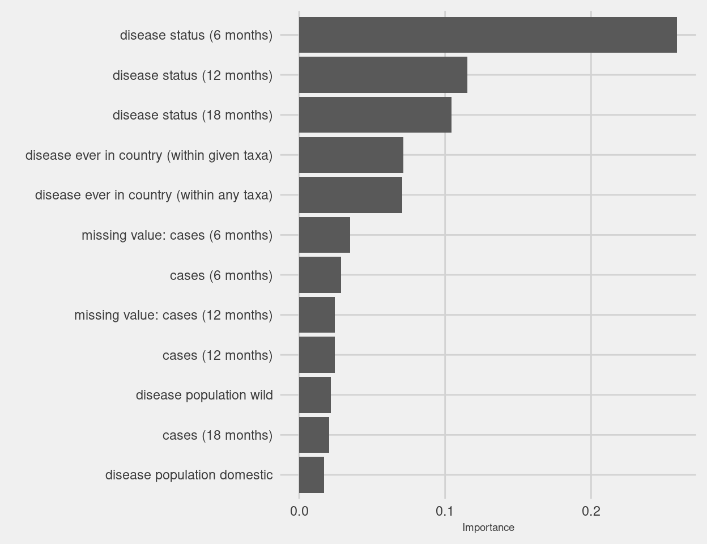
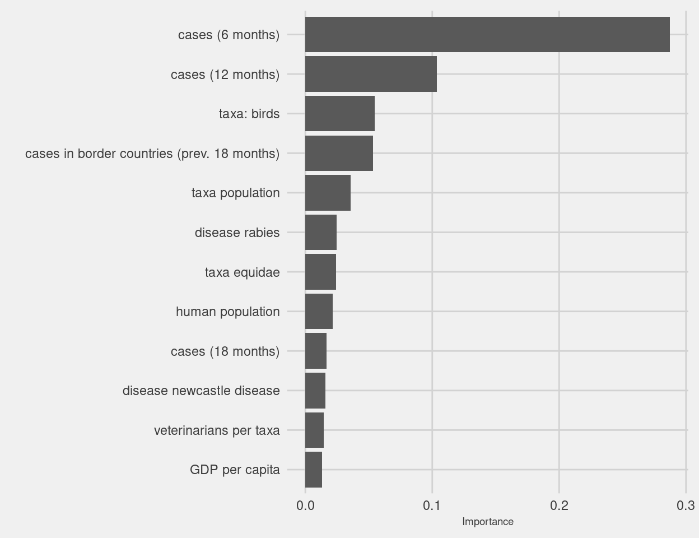
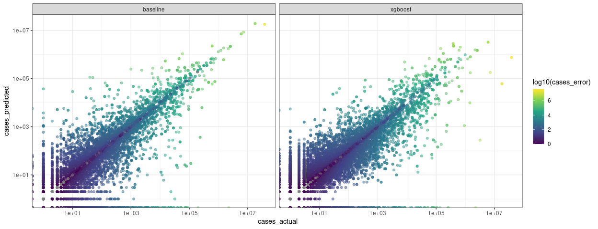
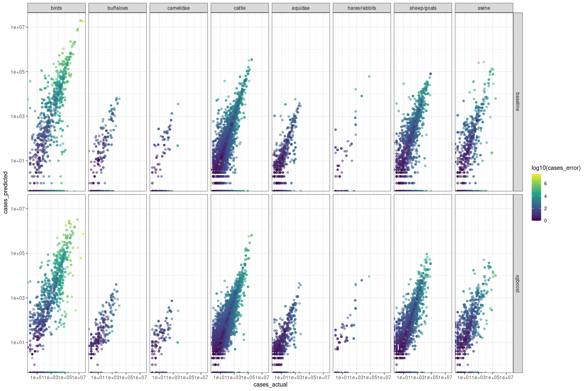

## Variable importance
<details>
<summary>disease status overall variable importance</summary>
<!-- -->
</details>

<details>
<summary>cases overall variable importance</summary>
<!-- -->
</details>

<details>
<summary>disease status partial dependency of lag vars by disease</summary>
<!-- -->
</details>

<details>
<summary>cases partial dependency of variables of interest by disease</summary>
<!-- -->
</details>


## Validation


<details>
<summary>disease status confusion matrix</summary>
<table class="table" style="margin-left: auto; margin-right: auto;">
 <thead>
  <tr>
   <th style="text-align:left;"> .metric </th>
   <th style="text-align:left;"> desc </th>
   <th style="text-align:left;"> model </th>
   <th style="text-align:right;"> full_model </th>
  </tr>
 </thead>
<tbody>
  <tr>
   <td style="text-align:left;"> accuracy </td>
   <td style="text-align:left;"> proportion of the data that are predicted correctly </td>
   <td style="text-align:left;"> baseline </td>
   <td style="text-align:right;"> 0.92 </td>
  </tr>
  <tr>
   <td style="text-align:left;"> accuracy </td>
   <td style="text-align:left;"> proportion of the data that are predicted correctly </td>
   <td style="text-align:left;"> xgboost </td>
   <td style="text-align:right;"> 0.97 </td>
  </tr>
  <tr>
   <td style="text-align:left;"> kap </td>
   <td style="text-align:left;"> similar measure to accuracy(), but is normalized by the accuracy that would be expected by chance alone and is very useful when one or more classes have large frequency distributions. </td>
   <td style="text-align:left;"> baseline </td>
   <td style="text-align:right;"> 0.56 </td>
  </tr>
  <tr>
   <td style="text-align:left;"> kap </td>
   <td style="text-align:left;"> similar measure to accuracy(), but is normalized by the accuracy that would be expected by chance alone and is very useful when one or more classes have large frequency distributions. </td>
   <td style="text-align:left;"> xgboost </td>
   <td style="text-align:right;"> 0.87 </td>
  </tr>
</tbody>
</table>
</details>

<details>
<summary>disease status direction change confusion matrix</summary>
<table class="table" style="margin-left: auto; margin-right: auto;">
 <thead>
  <tr>
   <th style="text-align:left;"> .metric </th>
   <th style="text-align:left;"> desc </th>
   <th style="text-align:left;"> model </th>
   <th style="text-align:right;"> full_model </th>
  </tr>
 </thead>
<tbody>
  <tr>
   <td style="text-align:left;"> accuracy </td>
   <td style="text-align:left;"> proportion of the data that are predicted correctly </td>
   <td style="text-align:left;"> baseline </td>
   <td style="text-align:right;"> 0.92 </td>
  </tr>
  <tr>
   <td style="text-align:left;"> accuracy </td>
   <td style="text-align:left;"> proportion of the data that are predicted correctly </td>
   <td style="text-align:left;"> xgboost </td>
   <td style="text-align:right;"> 0.97 </td>
  </tr>
  <tr>
   <td style="text-align:left;"> kap </td>
   <td style="text-align:left;"> similar measure to accuracy(), but is normalized by the accuracy that would be expected by chance alone and is very useful when one or more classes have large frequency distributions. </td>
   <td style="text-align:left;"> baseline </td>
   <td style="text-align:right;"> 0.14 </td>
  </tr>
  <tr>
   <td style="text-align:left;"> kap </td>
   <td style="text-align:left;"> similar measure to accuracy(), but is normalized by the accuracy that would be expected by chance alone and is very useful when one or more classes have large frequency distributions. </td>
   <td style="text-align:left;"> xgboost </td>
   <td style="text-align:right;"> 0.48 </td>
  </tr>
</tbody>
</table>
Note there are baseline cases where disease status is positive but cases are NA, which are imputed in the model as 0. 
</details>


<details>
<summary>disease status direction change confusion matrix by select diseases</summary>
<table class="table" style="margin-left: auto; margin-right: auto;">
 <thead>
  <tr>
   <th style="text-align:left;"> Disease </th>
   <th style="text-align:left;"> Baseline Accuracy </th>
   <th style="text-align:left;"> REPEL (Overall/New Outbreaks) </th>
  </tr>
 </thead>
<tbody>
  <tr>
   <td style="text-align:left;"> foot and mouth disease </td>
   <td style="text-align:left;"> 67% </td>
   <td style="text-align:left;"> 100% / 100% </td>
  </tr>
  <tr>
   <td style="text-align:left;"> vesicular stomatitis </td>
   <td style="text-align:left;"> 62% </td>
   <td style="text-align:left;"> 98% / 93% </td>
  </tr>
  <tr>
   <td style="text-align:left;"> ovine bluetongue disease </td>
   <td style="text-align:left;"> 44% </td>
   <td style="text-align:left;"> 91% / 78% </td>
  </tr>
  <tr>
   <td style="text-align:left;"> rift valley fever </td>
   <td style="text-align:left;"> 44% </td>
   <td style="text-align:left;"> 83% / 68% </td>
  </tr>
  <tr>
   <td style="text-align:left;"> pleuropneumonia </td>
   <td style="text-align:left;"> 97% </td>
   <td style="text-align:left;"> 99% / 41% </td>
  </tr>
  <tr>
   <td style="text-align:left;"> peste des petits ruminants </td>
   <td style="text-align:left;"> 93% </td>
   <td style="text-align:left;"> 97% / 35% </td>
  </tr>
  <tr>
   <td style="text-align:left;"> ovine pox disease </td>
   <td style="text-align:left;"> 95% </td>
   <td style="text-align:left;"> 97% / 27% </td>
  </tr>
  <tr>
   <td style="text-align:left;"> lumpy skin disease </td>
   <td style="text-align:left;"> 95% </td>
   <td style="text-align:left;"> 95% / 20% </td>
  </tr>
  <tr>
   <td style="text-align:left;"> newcastle disease </td>
   <td style="text-align:left;"> 85% </td>
   <td style="text-align:left;"> 91% / 14% </td>
  </tr>
  <tr>
   <td style="text-align:left;"> african swine fever </td>
   <td style="text-align:left;"> 95% </td>
   <td style="text-align:left;"> 97% / 10% </td>
  </tr>
  <tr>
   <td style="text-align:left;"> highly pathogenic avian influenza </td>
   <td style="text-align:left;"> 94% </td>
   <td style="text-align:left;"> 94% / 9% </td>
  </tr>
  <tr>
   <td style="text-align:left;"> classical swine fever </td>
   <td style="text-align:left;"> 97% </td>
   <td style="text-align:left;"> 97% / 5% </td>
  </tr>
  <tr>
   <td style="text-align:left;"> swine vesicular disease </td>
   <td style="text-align:left;"> 100% </td>
   <td style="text-align:left;"> 100% / 0% </td>
  </tr>
  <tr>
   <td style="text-align:left;"> african horse sickness </td>
   <td style="text-align:left;"> 99% </td>
   <td style="text-align:left;"> 99% / 0% </td>
  </tr>
</tbody>
</table>
</details>

<details>
<summary>disease status direction change confusion matrix by taxa</summary>
<table class="table" style="margin-left: auto; margin-right: auto;">
 <thead>
  <tr>
   <th style="text-align:left;"> Taxa </th>
   <th style="text-align:left;"> Baseline Accuracy </th>
   <th style="text-align:left;"> REPEL (Overall/New Outbreaks) </th>
  </tr>
 </thead>
<tbody>
  <tr>
   <td style="text-align:left;"> buffaloes </td>
   <td style="text-align:left;"> 54% </td>
   <td style="text-align:left;"> 99% / 97% </td>
  </tr>
  <tr>
   <td style="text-align:left;"> cats </td>
   <td style="text-align:left;"> 64% </td>
   <td style="text-align:left;"> 99% / 97% </td>
  </tr>
  <tr>
   <td style="text-align:left;"> dogs </td>
   <td style="text-align:left;"> 78% </td>
   <td style="text-align:left;"> 98% / 90% </td>
  </tr>
  <tr>
   <td style="text-align:left;"> camelidae </td>
   <td style="text-align:left;"> 45% </td>
   <td style="text-align:left;"> 94% / 89% </td>
  </tr>
  <tr>
   <td style="text-align:left;"> cervidae </td>
   <td style="text-align:left;"> 27% </td>
   <td style="text-align:left;"> 91% / 88% </td>
  </tr>
  <tr>
   <td style="text-align:left;"> hares/rabbits </td>
   <td style="text-align:left;"> 57% </td>
   <td style="text-align:left;"> 88% / 69% </td>
  </tr>
  <tr>
   <td style="text-align:left;"> sheep/goats </td>
   <td style="text-align:left;"> 93% </td>
   <td style="text-align:left;"> 98% / 65% </td>
  </tr>
  <tr>
   <td style="text-align:left;"> swine </td>
   <td style="text-align:left;"> 94% </td>
   <td style="text-align:left;"> 98% / 49% </td>
  </tr>
  <tr>
   <td style="text-align:left;"> cattle </td>
   <td style="text-align:left;"> 91% </td>
   <td style="text-align:left;"> 97% / 45% </td>
  </tr>
  <tr>
   <td style="text-align:left;"> equidae </td>
   <td style="text-align:left;"> 96% </td>
   <td style="text-align:left;"> 98% / 39% </td>
  </tr>
  <tr>
   <td style="text-align:left;"> birds </td>
   <td style="text-align:left;"> 88% </td>
   <td style="text-align:left;"> 95% / 8% </td>
  </tr>
</tbody>
</table>
</details>

<details>
<summary>disease status direction change confusion matrix by continent</summary>
<table class="table" style="margin-left: auto; margin-right: auto;">
 <thead>
  <tr>
   <th style="text-align:left;"> Continent </th>
   <th style="text-align:left;"> Baseline Accuracy </th>
   <th style="text-align:left;"> REPEL (Overall/New Outbreaks) </th>
  </tr>
 </thead>
<tbody>
  <tr>
   <td style="text-align:left;"> Americas </td>
   <td style="text-align:left;"> 89% </td>
   <td style="text-align:left;"> 97% / 55% </td>
  </tr>
  <tr>
   <td style="text-align:left;"> Asia </td>
   <td style="text-align:left;"> 93% </td>
   <td style="text-align:left;"> 97% / 54% </td>
  </tr>
  <tr>
   <td style="text-align:left;"> Africa </td>
   <td style="text-align:left;"> 92% </td>
   <td style="text-align:left;"> 97% / 45% </td>
  </tr>
  <tr>
   <td style="text-align:left;"> Europe </td>
   <td style="text-align:left;"> 92% </td>
   <td style="text-align:left;"> 96% / 40% </td>
  </tr>
  <tr>
   <td style="text-align:left;"> Oceania </td>
   <td style="text-align:left;"> 94% </td>
   <td style="text-align:left;"> 99% / 12% </td>
  </tr>
</tbody>
</table>
</details>

<details>
<summary>cases model stats</summary>

```
## # A tibble: 6 × 4
##   model    .metric .estimator     .estimate
##   <chr>    <chr>   <chr>              <dbl>
## 1 baseline rmse    standard   269883.      
## 2 xgboost  rmse    standard   440940.      
## 3 baseline rsq     standard        0.819   
## 4 xgboost  rsq     standard        0.000494
## 5 baseline mae     standard    10284.      
## 6 xgboost  mae     standard    14063.
```
</details>

<details>
<summary>cases residuals</summary>
<!-- -->
</details>

<details>
<summary>cases residuals by disease</summary>
<!-- -->
</details>

<details>
<summary>cases residuals by taxa</summary>
<!-- -->
</details>

<details>
<summary>cases residuals by continent</summary>
<!-- -->
</details>


### variable importance for specific cases of successfully predicting 0-1 switch
<!-- -->


