<small>_Click on the_ ▶ _︎arrows to expand sections._</small>

### Variable importance by disease

African Horse Sickness

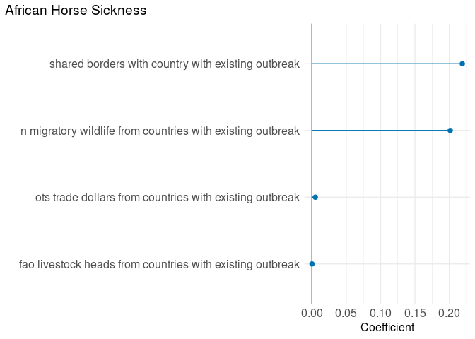<!-- -->

African Swine Fever

<!-- -->

Classical Swine Fever

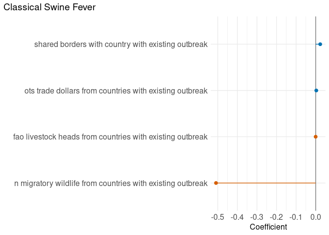<!-- -->

Foot And Mouth Disease

<!-- -->

Highly Pathogenic Avian Influenza

<!-- -->

Lumpy Skin Disease

<!-- -->

Newcastle Disease

<!-- -->

Ovine Bluetongue Disease

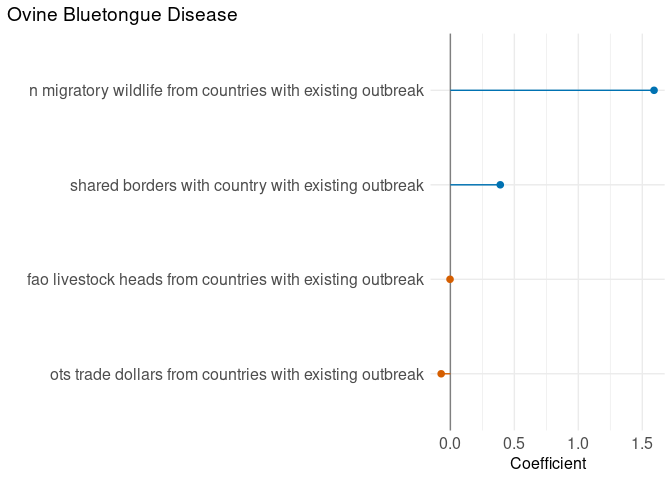<!-- -->

Ovine Pox Disease

<!-- -->

Peste Des Petits Ruminants

<!-- -->

Pleuropneumonia

<!-- -->

Rift Valley Fever

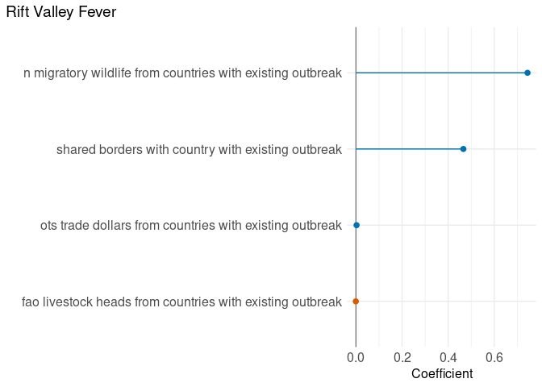<!-- -->

Vesicular Stomatitis

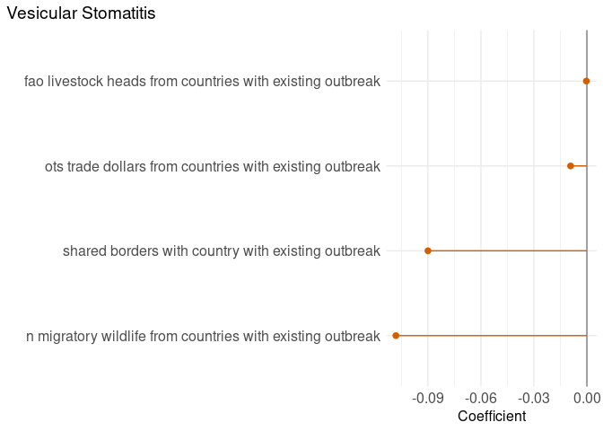<!-- -->

### Variable importance by disease and country (USA)

African Horse Sickness

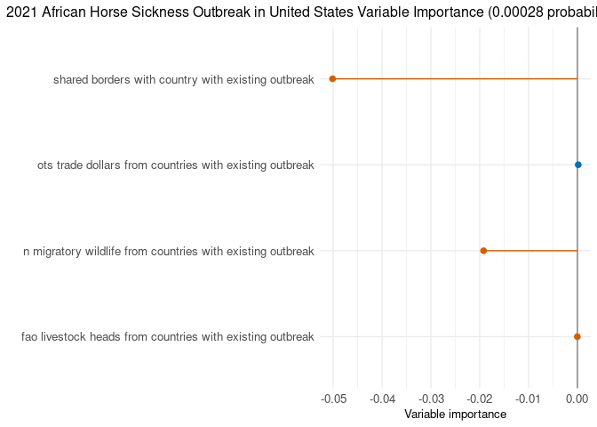<!-- -->

African Swine Fever

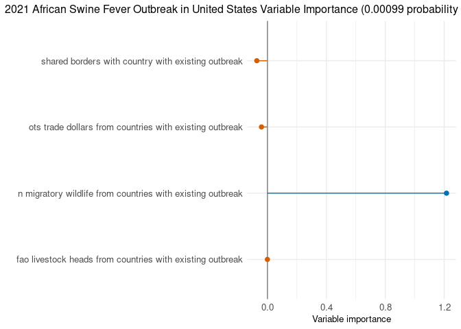<!-- -->

Classical Swine Fever

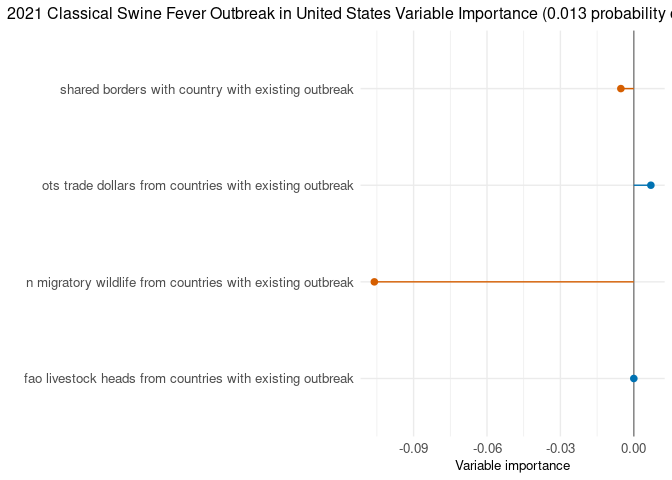<!-- -->

Foot And Mouth Disease

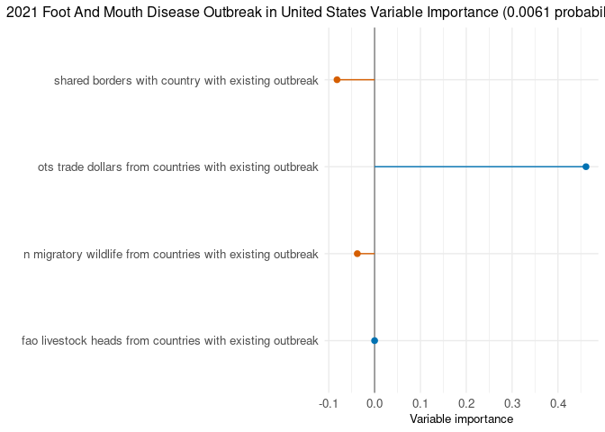<!-- -->

Highly Pathogenic Avian Influenza

<!-- -->

Lumpy Skin Disease

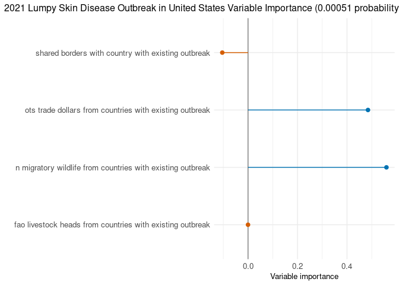<!-- -->

Newcastle Disease

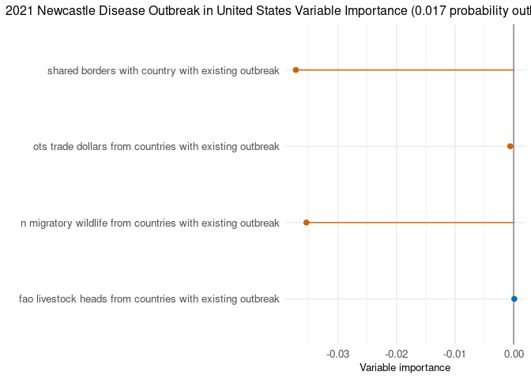<!-- -->

Ovine Bluetongue Disease

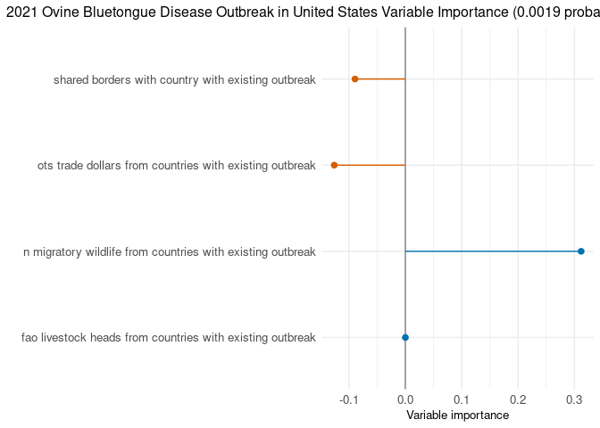<!-- -->

Ovine Pox Disease

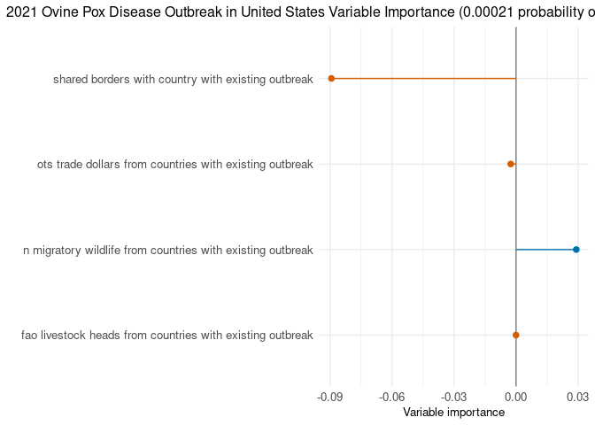<!-- -->

Peste Des Petits Ruminants

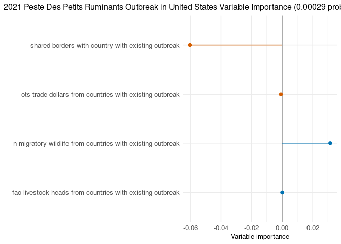<!-- -->

Pleuropneumonia

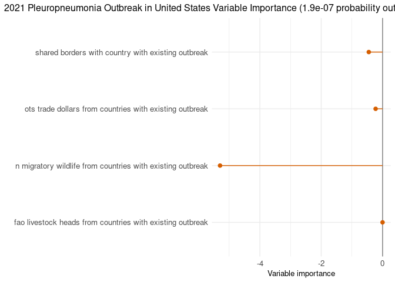<!-- -->

Rift Valley Fever

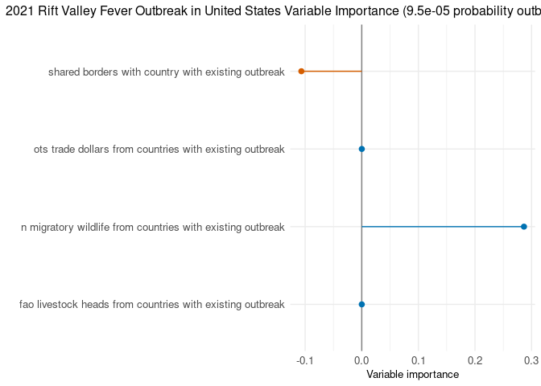<!-- -->

Vesicular Stomatitis

<!-- -->

### Variable importance by disease and country (USA), with country origins

African Horse Sickness

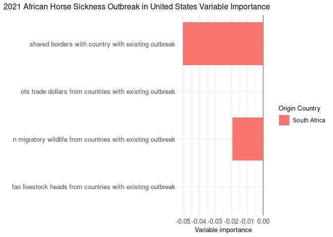<!-- -->

African Swine Fever

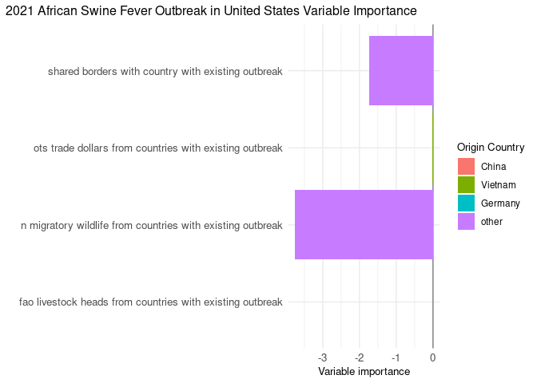<!-- -->

Classical Swine Fever

<!-- -->

Foot And Mouth Disease

<!-- -->

Highly Pathogenic Avian Influenza

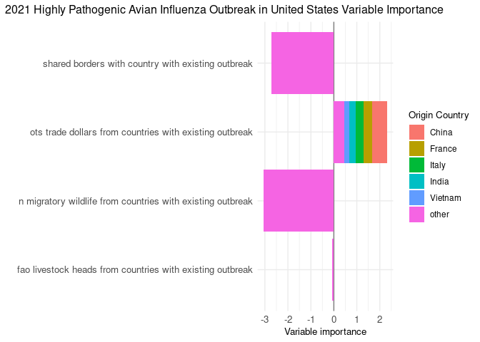<!-- -->

Lumpy Skin Disease

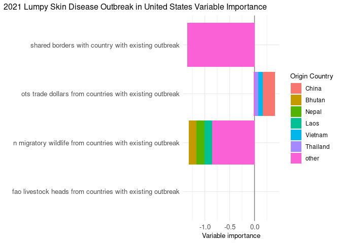<!-- -->

Newcastle Disease

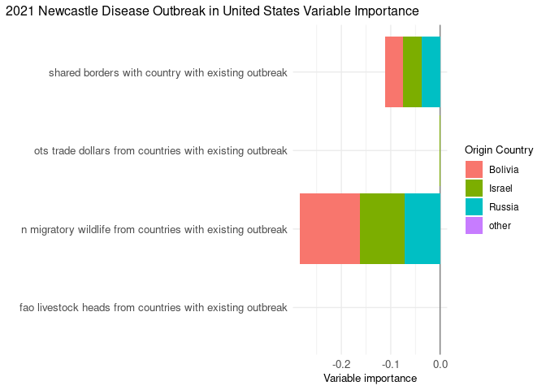<!-- -->

Ovine Bluetongue Disease

<!-- -->

Ovine Pox Disease

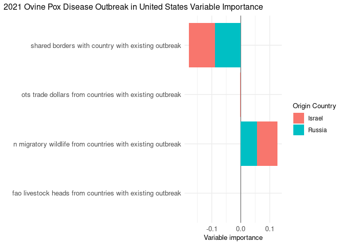<!-- -->

Peste Des Petits Ruminants

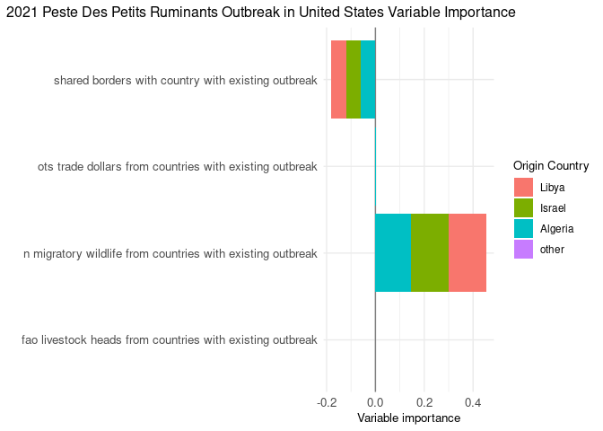<!-- -->

Pleuropneumonia

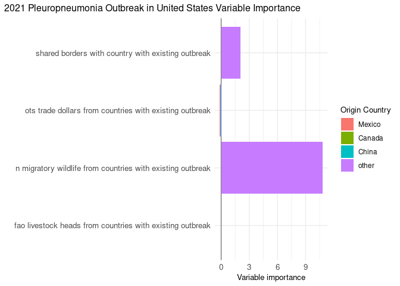<!-- -->

Rift Valley Fever

<!-- -->

### Disease status summary

